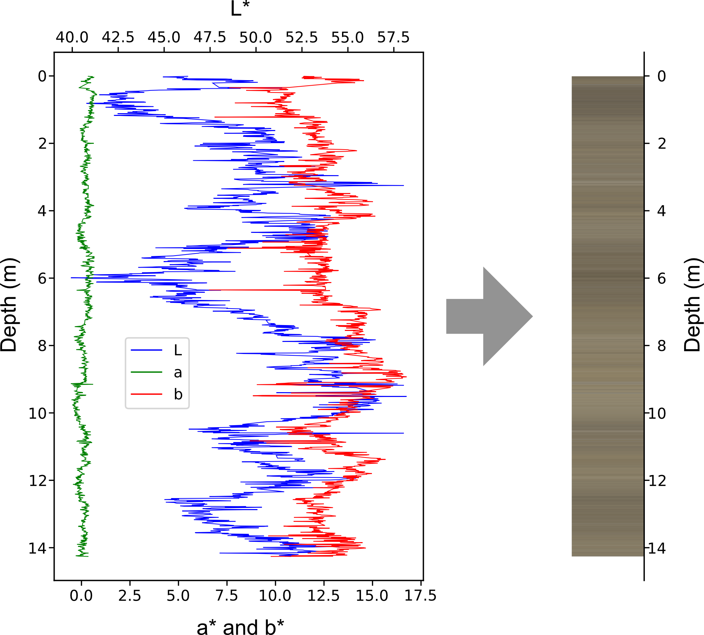

# Conversion of spectrophotometry data (CIE-L**a**b to sRGB)

Colour is an important parameter in the geosciences. It is used to describe sediment and often allows for the interpretation of depositional environment, estimate organic content or aids in the identification of geological boundaries, amongst others. 

In core analysis, colour is measured either manually or automatically with spectrophotometers. The output of these spectrophotometers, at least when we conducted these measurements more than 10 years ago, was a dataset in CIE-LAB format. While it would, theoretically, be possible to plot this data, it is much more straight forward to simply convert the data to the sRGB colorspace. 

An example is shown below, where on the left the raw CIE-LAB data is shown, and on the right the final colormap of the sediment.

